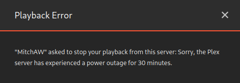

# Tautulli Session Notifier

This script terminates all running Plex sessions/streams and sends a 
customizable error message to the users using the Tautulli API.  

I have developed this as a basic script to terminate all sessions and
notify any Plex users currently watching if the battery of my UPS is 
low.

## Example
    
*The error message will appear to the user as something like this:*  




## Configuration

1. Create the configuration file:  
    ```sh
    cp config/config_example.json config/config.json
    ```

2. Update the tautulli URL with the url to your Tautulli instance:

    e.g. `http://192.168.1.10:8181`

3. Update the API key with your own API key for Tautulli:  

    This can be found in `Settings -> Web Interface -> API -> API key`

4. Update the message you would like to send after terminating a user's 
session.

## Dependencies

*Requires >= Python 3.6+:*

1. Create a virtual environment (Optional):  

    ```sh
    python -m venv .venv
    ```

2. Activate the virtual environment on Linux (Optional):  
    ```sh
    source .venv/bin/activate
    ```

2. Activate the virtual environment on Windows (Optional):
    ```sh
    .venv/Scripts/activate.ps1
    ```
3. Install the required dependencies:
    ```sh
    pip install -U -r requirements.txt`
    ````


## Running

Execute the main python script:

```sh
python main.py
```
